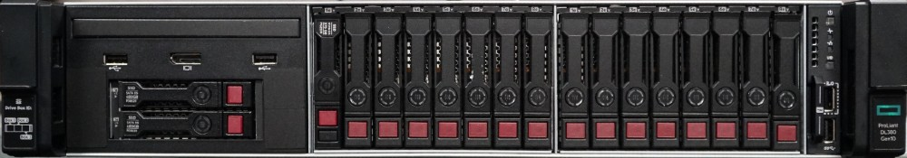
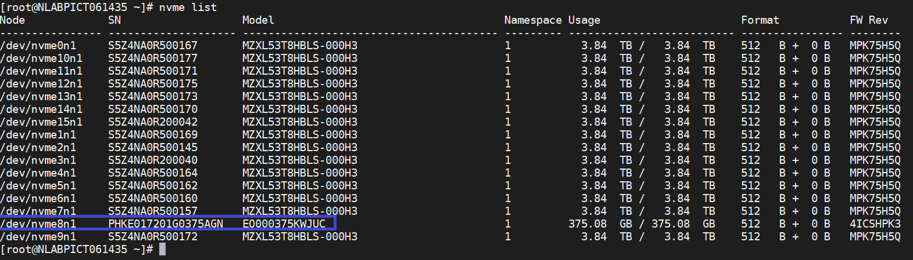

= Replace drives for HPE DL380
:icons: font
:imagesdir: ../media/

[.lead]
Choose from the procedures listed here to replace a drive proactively, replace a drive after it has failed, and replace a cache drive. replace a metadata drive or a block drive in your SolidFire eSDS cluster. The Element UI *Cluster > Drives* page shows the drive wear information.

* <<Replace a drive proactively>>
* <<Replace a faulty drive>>
* <<Replace a cache drive>>

=== Replace a drive proactively

Perform this procedure if you want to proactively replace a metadata drive or a block drive in your SolidFire eSDS cluster. The Element UI *Cluster* > *Drives* page shows the drive wear information.

.What you'll need

* From the NetApp Element software UI, ensure that your cluster is in good health and there are no warnings or cluster faults. You can access the Element UI by using the management virtual IP (MVIP) address of the primary cluster node.
* Ensure that there are no active jobs running on the cluster.
* Ensure that you have familiarized yourself with all the steps.
* Ensure that you take necessary precautions to prevent electrostatic discharge (ESD) while handling drives.

.Steps

. Perform the following steps in the Element UI:
 .. In the Element UI, select *Cluster* > *Drives* > *Active*.
 .. Select the drive that you want to replace.
 .. Make a note of the serial number of the drive. This will help you locate the corresponding BayID in the IPMI interface of the node (HPE Integrated Lights-Out or iLO, in this case).
 .. Select *Bulk Actions* > *Remove*. After you remove the drive, the drive goes into the *Removing* state. It stays in the *Removing* state for a while, waiting for the data on the drive to be synced or redistributed to the remaining drives in the cluster. After the remove is complete, the drive moves to the *Available* state.
. Perform the following steps to locate the drive slot of the drive that you are replacing:
 .. Log in to the IPMI interface of the node (iLO in this case).
 .. Select *System Information* from the left-hand navigation, and then select *Storage*.
 .. Match the serial number you made a note of in the previous step with what you see on the screen.
 .. Look for the slot number listed against the serial number. This is the physical slot from which you must remove the drive.
. Now that you have identified the drive, physically remove it as follows:
 .. Identify the drive box.
+
The following image shows the front of the server with the drives:
+

 .. Press the power button on the drive that you want to replace. The LED blinks for 5-10 seconds and stops.
 .. After the LED stops blinking and the drive is powered off, remove it from the server by pressing the red button and pulling the latch.
+
NOTE: Ensure that you handle drives very carefully.
+
After you physically remove the drive, the drive state changes to *Failed* in the Element UI.
. In the Element UI, select *Cluster* > *Drives* > *Failed*.
. Select the icon under *Actions*, and then select *Remove*.
+
Now you can go ahead and install the new drive in the node.

. Make a note of the serial number of the new drive.
. Insert the replacement drive by carefully pushing the drive into the bay using the latch and closing the latch. The drive powers on when inserted correctly.
. Perform the following steps to verify the new drive details in iLO:
.. Log in to iLO.
.. Select *Information* > *Integrated Management Log*. You will see an event logged for the drive that you added.
.. Select *System Information* from the left-hand navigation, and then select *Storage*.
.. Scroll till you find information about the bay that you replaced the drive in.
.. Verify that the serial number on your screen matches the serial number of the new drive that you replaced.
. Add the new drive information in the `sf_sds_config.yaml` file for the node in which you replaced the drive.
+
The `sf_sds_config.yaml` file is stored in `/opt/sf/`. This file includes all the information about the drives in the node. Every time you replace a drive, you must enter the replacement drive information in this file. For more information about this file, see link:reference_esds_sf_sds_config_file.html[Contents of the sf_sds_config.yaml file^].
+
.. Establish an SSH connection to the node by using PuTTY.
.. In the PuTTY configuration window, enter node MIP in the *Host Name (or IP address)* field.
.. Select *Open*.
.. In the terminal window that opens, log in with your username and password.
.. Run the `# cat /opt/sf/sf_sds_config.yaml` command to list the contents of the file.
.. Replace the entries in the `dataDevices` or `cacheDevices` lists for the drive you replaced with the new drive information.
.. Run `# systemctl start solidfire-update-drives`.
+
You see the Bash prompt after this command runs. You should go to the Element UI after this to add the drive to the cluster. The Element UI shows an alert for a new drive that is available.

. Select *Cluster* > *Drives* > *Available*.
+
You see the serial number of the new drive that you installed.

. Select the icon under *Actions*, and then select *Add*.
. Refresh the Element UI after the block sync job completes. You see that the alert about the drive available has cleared if you access the *Running Tasks* page from the *Reporting* tab of the Element UI.

=== Replace a faulty drive

If your SolidFire eSDS cluster has a faulty drive, the Element UI displays an alert. Before you remove the drive from the cluster, verify the reason for failure by looking at the information in the IPMI interface for your node/server. These steps are applicable if you are replacing a block drive or a metadata drive.

.What you'll need

* From the NetApp Element software UI, verify that the drive has failed. Element displays an alert when a drive fails. You can access the Element UI by using the management virtual IP (MVIP) address of the primary cluster node.
* Ensure that you have familiarized yourself with all the steps.
* Ensure that you take necessary precautions to prevent electrostatic discharge (ESD) while handling drives.

.Steps

. Remove the failed drive from the cluster as follows using the Element UI:
.. Select *Cluster* > *Drives* > *Failed*.
.. Note the node name and serial number associated with the failed drive.
.. Select the icon under *Actions*, and then select *Remove*.
 If you see warnings of the service associated with the drive, wait until bin sync completes, and then remove the drive.
. Perform the following steps to verify the drive failure and view the events logged that are associated with the drive failure:
.. Log in to the IPMI interface of the node (iLO in this case).
.. Select *Information* > *Integrated Management Log*. The reason for the drive failure (for example, SSDWearOut) and the location is listed here. You can also see an event stating that the status of the drive is degraded.
.. Select *System Information* from the left-hand navigation, and then select *Storage*.
.. Verify the information available about the failed drive. The status of the failed drive will say *Degraded*.
. Remove the drive physically as follows:
.. Identify the drive in the chassis.
+
The following image shows the front of the server with the drives:
+

 .. Press the power button on the drive that you want to replace. The LED blinks for 5-10 seconds and stops.
 .. After the LED stops blinking and the drive is powered off, remove it from the server by pressing the red button and pulling the latch.
+
NOTE: Ensure that you handle drives very carefully.
. Insert the replacement drive by carefully pushing the drive into the bay using the latch and closing the latch. The drive powers on when inserted correctly.
. Verify the new drive details in iLO:
.. Select *Information* > *Integrated Management Log*. You see an event logged for the drive that you added.
.. Refresh the page to see the events logged for the new drive that you added.
. Verify the health of your storage system in iLO:
.. Select *System Information* from the left-hand navigation, and then select *Storage*.
.. Scroll till you find information about the bay in which you installed the new drive.
.. Make a note of the serial number.
. Add the new drive information in the `sf_sds_config.yaml` file for the node in which you replaced the drive.
+
The `sf_sds_config.yaml` file is stored in `/opt/sf/`. This file includes all the information about the drives in the node. Every time you replace a drive, you must enter the replacement drive information in this file. For more information about this file, see link:reference_esds_sf_sds_config_file.html[Contents of the sf_sds_config.yaml file^].
+
.. Establish an SSH connection to the node by using PuTTY.
.. In the PuTTY configuration window, enter node MIP in the *Host Name (or IP address)* field.
.. Select *Open*.
.. In the terminal window that opens, log in with your username and password.
.. Run the `# cat /opt/sf/sf_sds_config.yaml` command to list the contents of the file.
.. Replace the entries in the `dataDevices` or `cacheDevices` lists for the drive you replaced with the new drive information.
.. Run `# systemctl start solidfire-update-drives`.
+
You see the Bash prompt after this command runs. You should go to the Element UI after this to add the drive to the cluster. The Element UI shows an alert for a new drive that is available.

. Select *Cluster* > *Drives* > *Available*.
+
You see the serial number of the new drive that you installed.

. Select the icon under *Actions*, and then select *Add*.
. Refresh the Element UI after the block sync job completes. You see that the alert about the drive available has cleared if you access the *Running Tasks* page from the *Reporting* tab of the Element UI.

=== Replace a cache drive

Perform this procedure if you want to replace the cache drive in your SolidFire eSDS cluster. The cache drive is associated with metadata services. The Element UI *Cluster* > *Drives* page shows the drive wear information.

.What you'll need

* From the NetApp Element software UI, ensure that your cluster is in good health and there are no warnings or cluster faults. You can access the Element UI by using the management virtual IP (MVIP) address of the primary cluster node.
* Ensure that there are no active jobs running on the cluster.
* Ensure that you have familiarized yourself with all the steps.
* Ensure that you remove metadata services from the Element UI.
* Ensure that you take necessary precautions to prevent electrostatic discharge (ESD) while handling drives.

.Steps

. Perform the following steps in the Element UI:
.. In the Element UI, select *Cluster* > *Nodes* > *Active*.
.. Make a note of the node ID and management IP address of the node in which you are replacing the cache drive.
.. If the cache drive is healthy and you are proactively replacing it, select *Active Drives*, locate the metadata drive, and remove it from the UI.
+
After you remove it, the metadata drive goes to *Removing* state first, and then to *Available*.
.. If you are performing replacement after the cache drive failed, the metadata drive will be in *Available* state, and listed under *Cluster* > *Drives* > *Available*.
.. In the Element UI, select *Cluster* > *Drives* > *Active*.
.. Select the metadata drive associated with the NodeName, where you want to do the cache drive replacement.
.. Select *Bulk Actions* > *Remove*. After you remove the drive, the drive goes into the *Removing* state. It stays in the *Removing* state for a while, waiting for the data on the drive to be synced or redistributed to the remaining drives in the cluster. After the remove is complete, the drive moves to the *Available* state.
. Perform the following steps to locate the drive slot of the cache drive that you are replacing:
.. Log in to the IPMI interface of the node (iLO in this case).
.. Select *System Information* from the left-hand navigation, and then select *Storage*.
.. Locate the cache drive.
+
NOTE: Cache drives are of lesser capacity than storage drives.
.. Look for the slot number listed for cache drive. This is the physical slot from which you must remove the drive.
. Now that you have identified the drive, physically remove it as follows:
 .. Identify the drive box.
+
The following image shows the front of the server with the drives:
+

 .. Press the power button on the drive that you want to replace. The LED blinks for 5-10 seconds and stops.
 .. After the LED stops blinking and the drive is powered off, remove it from the server by pressing the red button and pulling the latch.
+
NOTE: Ensure that you handle drives very carefully.
+
After you physically remove the drive, the drive state changes to *Failed* in the Element UI.
. Make a note of the HPE model number and the ISN (serial number) of the new cache drive.
. Insert the replacement drive by carefully pushing the drive into the bay using the latch and closing the latch. The drive powers on when inserted correctly.
. Perform the following steps to verify the new drive details in iLO:
 .. Log in to iLO.
 .. Select *Information* > *Integrated Management Log*. You see an event logged for the drive that you added.
 .. Select *System Information* from the left-hand navigation, and then select *Storage*.
 .. Scroll till you find information about the bay that you replaced the drive in.
 .. Verify that the serial number on your screen matches the serial number of the new drive that you installed.
. Add the new cache drive information in the `sf_sds_config.yaml` file for the node in which you replaced the drive.
+
The `sf_sds_config.yaml` file is stored in `/opt/sf/`. This file includes all the information about the drives in the node. Every time you replace a drive, you should enter the replacement drive information in this file. For more information about this file, see link:reference_esds_sf_sds_config_file.html[Contents of the sf_sds_config.yaml file^].

 .. Establish an SSH connection to the node by using PuTTY.
 .. In the PuTTY configuration window, enter node MIP address (that you made a note of from the Element UI earlier) in the *Host Name (or IP address)* field.
 .. Select *Open*.
 .. In the terminal window that opens, log in with your username and password.
 .. Run the `nvme list` command to list the NMVe devices.
+
You can see the model number and serial number of the new cache drive. See the following sample output:
+

 .. Add the new cache drive information in `/opt/sf/sf_sds_config.yaml`.
+
You should replace the existing cache drive model number and serial number with the corresponding information for the new cache drive. See the following example:
+
image::../media/dl380_model.png[Shows the model number and serial number.]

 .. Save the `/opt/sf/sf_sds_config.yaml` file.
. Perform the steps for the scenario that is applicable to you:
+
[%header,cols=2*]
|===
|Scenario
|Steps

|The new inserted cache drive shows up after you run the `nvme list` command
a|
. Run `# systemctl restart solidfire`. This takes around three minutes.
. Check the `solidfire` status by running `system status solidfire`.
. Go to step 9.

|The new inserted cache drive does not show up after you run the `nvme list` command
a|
. Reboot the node.
. After the node reboots, verify that the `solidfire` services are running by logging in to the node (using PuTTY), and running the `system status solidfire` command.
. Go to step 9.
|===
+
NOTE: Restarting `solidfire` or rebooting the node causes some cluster faults, which eventually clear in about five minutes.

. In the Element UI, add back the metadata drive that you removed:
.. Select *Cluster* > *Drives* > *Available*.
.. Select the icon under Actions, and select *Add*.
. Refresh your Element UI after the block sync job completes.
+
You can see that the alert about the drive available has cleared along with other cluster faults.

== Find more information
* https://www.netapp.com/data-storage/solidfire/documentation/[NetApp SolidFire Resources Page^]
* https://docs.netapp.com/sfe-122/topic/com.netapp.ndc.sfe-vers/GUID-B1944B0E-B335-4E0B-B9F1-E960BF32AE56.html[Documentation for earlier versions of NetApp SolidFire and Element products^]
